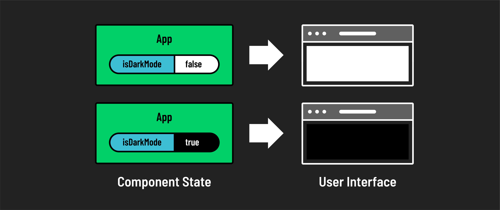

# 

**Learning objective:** By the end of this lesson, students will be able to use the `useState` hook to create stateful components.

## Creating State

State is created in a React component using the `useState` hook. The `useState` hook is a function that returns an array with two elements: 

1. A state variable to hold your state data
2. A state setter function that allows you to update that state value and trigger the re-render of a component

For this section, we will focus on the following:

- Creating a state variable
- Assigning an initial state value
- Visually displaying that state value

Let's get to work creating our first state variable. 

First, import the `useState` hook from React. Then, we'll use a [destructuring assignment](https://developer.mozilla.org/en-US/docs/Web/JavaScript/Reference/Operators/Destructuring_assignment) to unpack the two values returned from our state hook: a state variable and a setter function.

We will name our state variable `isDarkMode` and our function `setIsDarkMode`. 

```jsx
// src/App.js
import { useState } from "react";
import "./App.css";

const App = () => {
    const [isDarkMode, setIsDarkMode] = useState();

    return (
        <h1>Hello world!</h1>
    );
}

export default App;
```

> Destructuring Syntax: This syntax might feel unfamiliar at first, but let's take a closer look at what is happening here. Imagine `useState` as a box, when we open the box we are given two items: a variable to store data and a function to update that variable. What we name these items is up to us, but should reflect the data being stored and updated. In this case `isDarkMode` is our state variable that holds the current state (like whether dark mode is on or off), and `setIsDarkMode` is a function that lets us change or *set* this state.

> In a later section, we will dive into `setIsDarkMode` and how to use it to update the state value.


Let's add a `console.log` to take a look at our new state value `isDarkMode`:

```jsx
// src/App.js

import { useState } from "react";
import "./App.css";

const App = () => {
    const [isDarkMode, setIsDarkMode] = useState();

    // Add a console.log
    console.log('Our isDarkMode state value is:', isDarkMode);

    return (
        <h1>Hello world!</h1>
    );
}

export default App;
```

> Make sure your console.log is outside of the return statement.

## Initial State Value

In your terminal, run:

```bash
npm run dev
```

Then navigate to:

```bash
http://localhost:5173/
```

We should see that the state value is `undefined`. This is because we have not assigned an initial state value! 

For our dark mode toggle, it makes sense to begin with the state set to `false`. This means that the app will start in 'light' mode by default.

To give our state an initial value, we just need to provide that value as an argument when calling the `useState` hook. 

```jsx
// src/App.js
import { useState } from 'react';
import 'App.css'

const App = () => {

    // Update the initial state value to `false`
    const [isDarkMode, setIsDarkMode] = useState(false);

    console.log('Our isDarkMode state value is:', isDarkMode);

    return (
        <h1>Hello world!</h1>
    );
}

export default App;
```

If we recheck our console, we can see that the state value is now `false`. This is the initial state value assigned to `isDarkMode`. If you change the initial state value to `true` and recheck the console, you will see that the state value is now `true`.

## Displaying State Value



Now that we can successfully log the value of our state, let's use this value to alter the UI of our component. We will use the `isDarkMode` state value to conditionally render dark or light modes. We can do this in many different ways, but for simplicity, let's use a ternary operator to conditionally apply a CSS class to our component.

Let's look at an example of this ternary operator:

```js
isDarkMode ? 'dark' : 'light'
```

The result of this operation will either be the string value `dark` or `light`. We can use this result as a class name to render a dark or light mode conditionally.

> In React, we will be using ternary operators a lot. They are a great way to conditionally render content in JSX where being concise is valuable. They don't take up much space in the markup and are easy to read.  In this example, if `isDarkMode` is true, we want to change the background color of our app to dark and the text color to light. If `isDarkMode` is false, we want to change the background color of our app to light and the text color to dark. 

Now, we'll create a couple of simple CSS classes to define our two modes.

First, clear the contents of index.css. We don't need to delete the file, just the default styles provided.
Next, Replace the contents of `App.css` with the following two classes:

```css
/* src/App.css */

.light {
    background-color: #ffffff; /* white background */
    color: #333333; /* darker text for contrast */
    border-color: #dddddd; /* light grey borders */
    font-family: 'Arial', sans-serif;
}

.dark {
    background-color: #2c3e50; /* dark background */
    color: #ecf0f1; /* light text for contrast */
    border-color: #34495e; /* slightly darker border for depth */
    font-family: 'Arial', sans-serif;
}
```

Now we are ready to bring these elements together and conditionally apply our CSS classes depending on our state:

```jsx
// src/App.js
import { useState } from 'react';

const App = () => {
    const [isDarkMode, setIsDarkMode] = useState(false);

    console.log('Our isDarkMode state value is:', isDarkMode);

    // use className to apply styles in react
    return (
        <div className={isDarkMode ? 'dark': 'light'}>  
            <h1>Hello world!</h1>
        </div>
    );
}

export default App;
```

If you change the initial state to `true` and check the browser, you will see that our component has taken on some dark mode styling. If you change the initial state to `false`, you will see that our component has taken on our light mode styling.

## Building State in React applications

In React, deciding *what* to keep in state is important for your application's functionality. Here are some key questions to help you figure out what should go into the state of a component:

**Data for Rendering**
- What information does the component need to show? For instance, if you're making a to-do list app, the state might need to include the list of tasks.

**Data to Monitor**
- What information does the component need to track? This could be anything that changes over time or in response to user interactions, like whether a task is marked as done.

**Data to Update**
- What information will change within the component? Consider what needs to be dynamic, like adding a new task to your to-do list.

### Types of data to store in state

Whether it's a simple string or a complex array of objects, the `useState` hook in React is flexible and can accommodate any Javascript data type. This allows us to manage and render dynamic content in many forms. 

Here are some examples:

**Strings and Numbers:** For straightforward data like a user's name or a counter, use simple strings or numbers.

```jsx
const [count, setCount] = useState(0);
const [name, setName] = useState('John Doe');
```

**Objects:** When you have more complex related information, such as user details, an object might be the most efficient way to store it.

```jsx
const [user, setUser] = useState({
    name: 'John Doe',
    age: 25,
    email: 'johnDoe@mail.com'
});
```

**Arrays:** If you're dealing with a list of items, like books in a library app, an array is ideal. This is especially handy when working with data from APIs or in CRUD applications.

```jsx
const [books, setBooks] = useState([
    {
        title: 'The Great Gatsby',
        author: 'F. Scott Fitzgerald'
    },
    {
        title: 'To Kill a Mockingbird',
        author: 'Harper Lee'
    }
]);
```

> Notice that all of these data types were able to be passed in as the initial value of `useState()`.

### Dynamic state variables for user interactions

In React, some state variables are meant to frequently change and are named accordingly. These variables often control elements that users interact with, such as toggles or modals. For example, a boolean state variable can be used to manage the visibility of features like our dark mode toggle or a modal dialog.

```jsx
const [isModalOpen, setIsModalOpen] = useState(false);
```

These state variables typically begin with 'is', 'has', 'can', or other prefixes that imply a boolean value or state condition. The corresponding setter function starts with 'set' followed by the state variable's name. Using 'set' as a prefix is a widely adopted convention in programming, indicating that this function is used to set or update a variable.

Always think about the dynamic nature of your components when planning your state. 

## 🎓 You do: Create a new state item

Now it's your turn to practice. Create a new state in your React component. This state will be an object with four properties:

- `firstName`: Set this to a string with your first name.
- `lastName`: Set this to a string with your last name.
- `hasPets`: Set this to a boolean (true or false) indicating if you have pets.
- `age`: Set this to a number representing your age.

Once you have set up your state, do two things:

1. Log it: Use a `console.log` to see your state in the browser console.
2. Display in App: Render your state in your app. 
Display it as a sentence, like: "Hello, my name is Jane Doe, I am 25 years old, and I have pets."